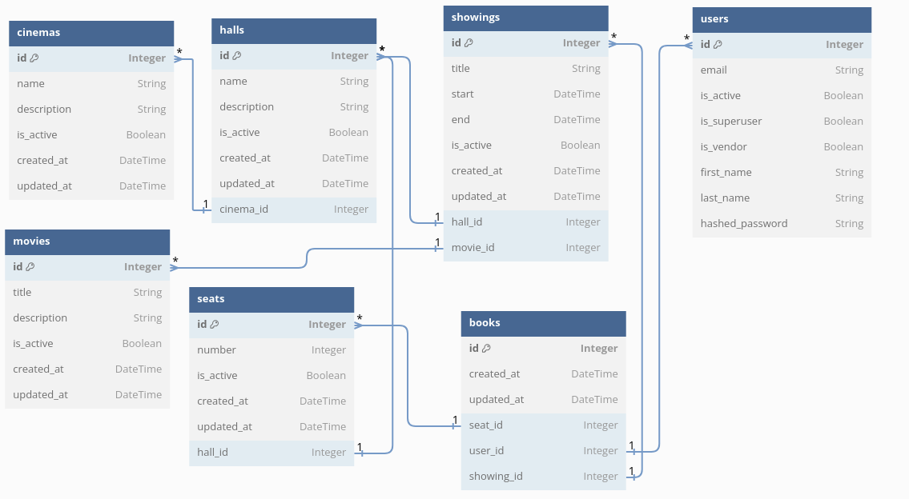

# Cinema Ticket Reservation System

#### This project is MVP for Course Work 2024

This project is based on microservices and uses the MVC pattern. The project is written in Python and deployed using docker containers. FastAPI is used as the main framework. For deployment, you can use docker-compose or helm chart/helmfile stack for kubernetes. For automatization of building the images jenkins pipelines can be used.

#### Stack of technologies:
* FastAPI
* FastAPI Security
* Celery
* Docker
* Docker Compose
* Kubernetes
* Helm
* Helmfile
* Jenkins

#### Databases:
* Postgres
* Redis

## FastAPI

To create REST API service that can be used for Fontend integration

## FastAPI Security

To implement Authorization bsed on JWT tokens

## Celery

For inizialization and distribution the load

## Docker, Docker Compose

To builf cross platfrom docker images and running on local machine

## Postgres

Main database for string the information about users and books

## Redis

Result backend & Broker for celery. Can be safely replaced with RabbitMQ if there is no need to store statuses in result backend.

## ER Diagram



### How to start server for local development:

```bash
docker compose up --build
```
Then follow the link: http://localhost:8000/docs

### How to build image:

```bash
docker build -f backend/Dockerfile -t backend backend/
```

### How to run tests:

```bash
docker run --rm -v $(pwd)/backend:$(pwd) --env PYTHONPATH=$(pwd) backend pytest
```

### How to deploy to Kubernetes using helmfile

```bash
cd kubernetes
```

Then run:
```bash
helmfile -e dev apply
```
Note: you should first install helm and helmfile on your local machine. Also you should have kubeconfig for the real kubernetes cluster or test cluster such as minikube.

### Helm chart

Chart ingressoute can work only with Traefik v2 ingress controller.